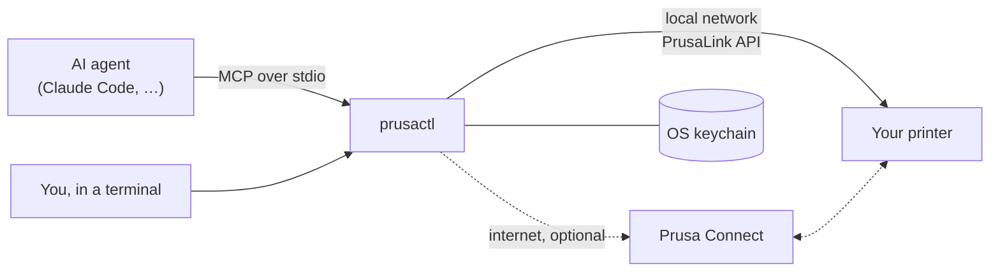

<h1 align="center">prusactl</h1>

<p align="center">
  <b>Hand your Prusa 3D printer to an AI agent.</b><br>
  An <a href="https://modelcontextprotocol.io">MCP</a> server that talks to the printer directly on your network, and through <a href="https://connect.prusa3d.com">Prusa Connect</a> from anywhere — and a CLI that does everything the agent can.
</p>

<p align="center">
  <a href="https://github.com/trevin-lee/prusactl/actions/workflows/ci.yml"></a>
  
  
  <a href="LICENSE"></a>
</p>

---

`prusactl mcp` gives an agent such as Claude hands on your printer. It can:

- **Watch:** check state, temperatures, job progress, and the camera (over RTSP with
  `setup --camera`, or through Connect).
- **Print:** upload files, start them, pause, resume, and stop, and (with Connect)
  queue them.
- **Control:** heat, home, move, load and unload filament, and level the bed:
  through Connect at any time, or as G-code while the printer is idle.
- **Answer the printer:** press the buttons on dialogs shown on its screen, such as
  runout or errors. Needs Connect.
- **Run G-code:** any G-code, over the direct connection, while the printer is idle.

It is one Go binary; no browser is needed. Setup is two terminal prompts.

## Things you can ask

> How's the print going? Show me the camera.
>
> Print `~/Downloads/bracket.bgcode`.
>
> Preheat for PETG.
>
> Object 3 is spaghetti. Cancel just that one.
>
> The printer is showing a dialog. What does it say?
>
> What did I print this week, and how many failed?

Cancelling one object, reading a dialog, and print history go through Prusa
Connect, so those need `prusactl login`; the rest works directly. So does the
camera, once you tell prusactl where it is (see [The camera](#the-camera)).

## Install

**Homebrew** (macOS and Linux):

```sh
brew install trevin-lee/tap/prusactl
```

This builds prusactl from source, so Homebrew installs Go first if you don't
have it; the build itself takes seconds. Tab completion for bash, zsh, and fish
comes with it. Update with `brew upgrade prusactl`. To remove it, see
[Uninstall](#uninstall).

> Installed prusactl 0.1.3 or earlier? That was a cask. Switch once with
> `brew uninstall --cask prusactl && brew update && brew install trevin-lee/tap/prusactl`.
> Your saved printer and Prusa Connect session are kept.

**A downloaded binary:** get the archive for your system from
[Releases](https://github.com/trevin-lee/prusactl/releases): macOS (universal),
Linux (x86-64, ARM64, ARMv7 such as a Raspberry Pi), or Windows (x86-64, ARM64).
`checksums.txt` lists their SHA-256 sums.

```sh
tar -xzf prusactl_*_linux_arm64.tar.gz   # macOS and Linux: unpack the one you downloaded
sudo install prusactl /usr/local/bin/    # or any other folder on your PATH
```

On Windows, unzip it and put `prusactl.exe` in a folder on your `PATH`. The
binaries aren't code-signed: if macOS won't open it because it can't verify the
developer, run `xattr -d com.apple.quarantine /usr/local/bin/prusactl`. To
update, replace the file with a newer release. `prusactl help completion`
shows how to add Tab completion.

**Go:**

```sh
go install github.com/trevin-lee/prusactl/cmd/prusactl@latest
```

This puts it in `$(go env GOPATH)/bin`, which needs to be on your `PATH`. It
needs Go 1.26.6 or newer; recent Go versions fetch that on their own.

Check it worked with `prusactl --version`.

### Uninstall

First remove what prusactl saved: `prusactl setup --forget` deletes the
printer's address and password, and `prusactl logout` deletes the Prusa Connect
session. Then remove the program with `brew uninstall prusactl`, or by deleting
the file. All that's left is a `prusactl` folder holding an empty lock file, in
your config directory (`~/Library/Application Support` on macOS, `~/.config` on
Linux, `%AppData%` on Windows); delete it too if you like.

## Quick start

```sh
prusactl setup 192.168.1.50    # the printer's address; asks for its PrusaLink password
prusactl status

prusactl setup --camera rtsp://192.168.1.60/live   # optional: the camera, no Connect needed
prusactl login                 # optional: Prusa Connect, for remote access, camera, dialogs
```

The PrusaLink password is on the printer under **Settings → Network → PrusaLink**.
PrusaLink is on by default; if someone turned it off, turn it back on there.

`setup` saves one printer for the direct route; running it again for another
printer replaces the first (it says so). With several printers, set up the one
you use most and reach the others through Prusa Connect.

## Connect an AI agent

**Claude Code:**

```sh
claude mcp add --scope user prusa -- "$(command -v prusactl)" mcp
```

`$(command -v prusactl)` saves the full path, so it works even when the app isn't
started from a terminal that has your `PATH`.

**Any other MCP client:** add prusactl as a stdio server, using the path that
`command -v prusactl` prints (`where prusactl` on Windows):

```json
{
  "mcpServers": {
    "prusa": { "command": "/opt/homebrew/bin/prusactl", "args": ["mcp"] }
  }
}
```

**The MCP bundle:** each release includes `prusactl.mcpb`, which carries its own
copy of prusactl for macOS, Linux x86-64, and Windows x86-64. Open it in an app
that installs MCPB extensions, such as Claude Desktop (double-click the file),
and enter the printer's address and PrusaLink password when asked. The bundle
covers the direct route; Prusa Connect sign-in still needs `prusactl login` from
an installed copy.

prusactl is also listed in the [MCP Registry](https://registry.modelcontextprotocol.io)
as `io.github.trevin-lee/prusactl`, for clients that browse it.

## How it works



prusactl reaches the printer two ways, and each tool picks one:

| | Direct (PrusaLink) | Prusa Connect |
|---|---|---|
| Set up with | `prusactl setup` and the password on the printer's screen | `prusactl login` with your Prusa Account |
| Reaches the printer | On your network | From anywhere |
| Status, files, upload, print, pause/resume/stop | ✅ | ✅ |
| Heat, move, filament, leveling | ✅ via `run_gcode` (printer idle) | ✅ via firmware commands |
| Any G-code | ✅ | ❌ |
| Camera | ✅ via RTSP and ffmpeg, once its address is saved | ✅ |
| On-screen dialogs, queue, history, events | ❌ | ✅ |

The direct route is used whenever the printer answers. Otherwise, or for
Connect-only features, the tool goes through Connect. Results from tools that
can take either route say which one they used (`via`); the rest always use the
route their feature needs.

### The camera

The Buddy3D camera is not part of the printer. It is a separate Wi-Fi device that
talks to Prusa Connect on its own and serves a video stream at
`rtsp://<camera-ip>/live`; the printer's PrusaLink has no camera endpoint (Buddy
firmware serves none), so a direct connection alone can't show it. Tell prusactl
where the camera is and it grabs one frame at a time with
[ffmpeg](https://ffmpeg.org), which must be on your `PATH`:

```sh
prusactl setup --camera rtsp://192.168.1.60/live   # find the camera's IP in your router
prusactl camera snapshot.jpg
```

A snapshot comes from the first source that works: the printer's own
`/api/v1/cameras/snap`, if its PrusaLink has one (other PrusaLink builds do);
the saved RTSP address; then Prusa Connect. `via: "direct"` limits it to the
first two, `via: "connect"` to Connect. `PRUSACTL_CAMERA_URL` overrides the saved
address. An address with a user or password is refused: ffmpeg would get the
password on its command line, where any local user can read it with `ps`, and it
would sit in plain text in the config. The Buddy3D camera takes none.

Only plain `rtsp://` addresses are accepted. `rtsps://` is refused on purpose:
FFmpeg 7.1.5 completes the TLS handshake with a self-signed certificate and sends
the camera's credentials even with `-tls_verify 1` and `-ca_file`, because its RTSP
code never hands those options to the TLS layer. The Buddy3D camera serves plain
RTSP, so this costs nothing there. Residual risk: plain RTSP sends the video unencrypted, so anyone on your network
can watch it; keep the camera off untrusted
networks.

### Signing in to Prusa Connect

`prusactl login` asks for your Prusa Account email and password, plus a 2FA
code if your account has one. It fills in Prusa's own login page over HTTPS the
same way a browser would. It then trades the resulting code for tokens, using
the OAuth + PKCE flow of the Connect web app.

**Letting an AI agent sign in for you.** `prusactl login --manual` never sees
a password. It prints a Prusa Account link on a line of its own (and opens it
in your browser unless you pass `--no-open`), then reads one line from stdin:
the address the browser ends on after you approve, which looks like
`https://connect.prusa3d.com/login/auth-callback?code=...&state=...` (the bare
`code=` value also works). An agent can drive it.
There is no loopback mode: Prusa Account rejects a
`127.0.0.1` redirect for the Connect client ("Mismatching redirect URI"), so
the code can only be read from the address bar. It also relies on Connect's
`auth-callback` page leaving a code alone when its `state` isn't one the page
issued, which is how the page behaves today. If Prusa changes that, the sign-in
fails at the token step, and the fix is an update to prusactl.

- **Your password** is sent only to account.prusa3d.com and is never stored.
- **Where tokens are kept:** the OS keychain (macOS Keychain, Secret Service, or
  Windows Credential Manager), under the service `prusactl`. A machine without
  one, such as a headless Raspberry Pi, gets `secrets.json` in prusactl's config
  directory instead, readable only by you; `PRUSACTL_KEYRING=file` forces that.
- **Staying signed in:** tokens refresh on their own. Prusa rotates refresh
  tokens, so refreshes are coordinated between processes. Several agents can
  share one session without signing each other out.
- **Google or Apple sign-in** accounts need a Prusa Account password set before
  this works.

The printer's PrusaLink password is kept in the same keychain.

## MCP tools

| Tool | Route | What it does |
| --- | --- | --- |
| `connection_status` | both | How the printer can be reached right now, and what to set up |
| `list_printers`, `get_printer` | both | State, temperatures, job progress, and (via Connect) any dialog on screen |
| `list_printer_files`, `delete_printer_files` | both | Browse or clean up the printer's storage |
| `download_printer_file` | direct | Copy a file from the printer to this computer, e.g. to check the slicer settings a print used |
| `upload_file` | both | Send a local `.bgcode`/`.gcode` to the printer, and optionally start or queue it |
| `start_print` | both | Print a file already on the printer |
| `control_print` | both | Pause, resume, or stop |
| `get_transfers` | both | File transfers in progress |
| `run_gcode` | direct | Run G-code, such as heating, homing, moving, or filament changes, while the printer is idle |
| `get_camera_snapshot` | both | A camera image: from the camera's RTSP stream if its address is saved, else Connect's latest, with how old it is |
| `respond_to_dialog` | Connect | Press a button on the printer's screen |
| `list_supported_commands`, `send_command`, `get_command` | Connect | Every firmware command Connect exposes, with arguments and allowed states |
| `get_queue`, `add_to_queue`, `remove_from_queue` | Connect | The print queue |
| `list_jobs`, `get_job` | Connect | Print history, and the objects in a job that can be cancelled |
| `get_telemetry`, `list_events` | Connect | Telemetry history and the event log |
| `list_connect_files` | Connect | Connect cloud storage |
| `delete_connect_files` | Connect | Delete from Connect cloud storage, freeing the team's quota |
| `api_request` | both | Any other endpoint: `/api/...` goes to the printer, `/app/...` to Connect |

Every `printer` argument accepts a name, serial number, or Connect UUID. With one
printer you can leave it out. `via: "direct"` or `via: "connect"` forces a route.

## CLI

```text
prusactl setup [ADDRESS]           connect directly to the printer on your network
prusactl login [--manual]          optional: sign in to Prusa Connect
prusactl logout                    forget the Prusa Connect session
prusactl status                    printer state and how it is reachable
prusactl mcp                       run the MCP server on stdio

prusactl printers                  the printers prusactl can reach
prusactl print FILE                upload a sliced file and start printing it
prusactl start PATH                start a file already on the printer
prusactl pause | resume | stop     control the running print
prusactl gcode "G28" ["M104 S215"] run G-code as a one-off job
prusactl dialog BUTTON             answer a question on the printer's screen
prusactl files ls|get|put|rm       browse and manage files on the printer
prusactl cloud ls|rm               files in Prusa Connect's cloud storage
prusactl queue ls|add|rm           the Prusa Connect print queue
prusactl jobs [JOB-ID]             print history, or one job
prusactl events                    the printer's recent events
prusactl telemetry                 recorded temperatures and speeds
prusactl transfers                 file transfers in progress
prusactl camera [FILE]             save a snapshot from the printer's camera (RTSP or Connect)
prusactl cmd ls|send|status        run a firmware command through Prusa Connect

prusactl api [METHOD] PATH [JSON]  /api/... to the printer, /app/... to Prusa Connect
prusactl completion bash|zsh|fish  print a shell completion script
prusactl help [COMMAND]            the command list, or one command's details
prusactl version                   print the version (--version does the same)
```

The printer commands run the very tools the MCP server exposes, over an
in-memory connection, so the CLI and an agent reach the printer by the same code
path with the same safety checks, and neither can do something the other can't.
Most of them take `--printer NAME` to pick a printer and `--via direct` or
`--via connect` to force a route; `prusactl help <command>` lists what each one
accepts. Every one takes `--json`.

The same plate check applies: after a finished or stopped print, anything that
starts a job asks whether the plate is clear. `--plate-clear` answers yes, for
scripts.

`prusactl help <command>` (or `<command> --help`) explains a command and its
flags, and flags work before or after the arguments. Tab completion covers
commands, flags, and their values: Homebrew installs it for bash, zsh, and fish,
and `prusactl help completion` shows how to add it otherwise.

`prusactl setup --forget` removes the saved printer and camera. `--api-key` uses
a PrusaLink API key instead of the password, `--password-stdin` reads the secret
from a pipe, and `--camera URL` saves the camera's RTSP address (on its own it
leaves the printer alone; `--no-camera` forgets just the camera).

`prusactl api` masks API keys and tokens in responses (Connect's printer record
carries the PrusaLink and Connect keys), so its output is safe to paste or hand
to an agent. `--raw` shows them.

## Limits

- **It has no hands.** It can't clear the build plate, swap a spool, or fix a
  clog. The tool descriptions tell the agent to check the printer (and the camera,
  if any) before starting a print or moving anything. Tools that start a job
  refuse a busy printer. After a finished or stopped print, everything that
  starts a job or moves toward the plate (`start_print`, `upload_file` with
  print, `run_gcode`, and `send_command` HOME, MOVE, MOVE_Z,
  MESH_BED_LEVELING, or START_PRINT) also needs `plate_clear: true`, since the
  last part may still be there. Marking the printer ready is the same
  confirmation. `api_request` is raw access and skips these checks.
- **`run_gcode` runs as a tiny print job.** So it only works while the printer is
  idle, and it shows up in the printer's history. It also leaves the file
  `/usb/prusactl-macro.gcode` on the printer, which each run overwrites.
- **Connect's API is unofficial.** Prusa doesn't publish it; prusactl uses the
  same endpoints as connect.prusa3d.com, so a change on Prusa's side can break the
  Connect route. The direct route uses Prusa's documented
  [PrusaLink API](https://github.com/prusa3d/Prusa-Link-Web/blob/master/spec/openapi.yaml).
  If either changes, prusactl says so instead of misbehaving: "Prusa Connect
  answered in a way this version of prusactl doesn't recognize: …", naming the request
  and what was unexpected. Updating prusactl usually fixes it; if the newest
  version doesn't, report the message as an issue.

## Configuration

| Variable | Purpose |
| --- | --- |
| `PRUSACTL_HOST`, `PRUSACTL_USER`, `PRUSACTL_AUTH` | Override the saved printer address, username, or `digest`/`api-key` |
| `PRUSACTL_PASSWORD`, `PRUSACTL_API_KEY` | Supply the printer secret instead of the keychain |
| `PRUSACTL_KEYRING=file` | Keep credentials in `secrets.json` (mode 0600) instead of the OS keychain |
| `PRUSACTL_CAMERA_URL` | Override the saved camera's RTSP address, e.g. `rtsp://192.168.1.60/live` |
| `PRUSACTL_CONFIG` | Alternate config file (default: `prusactl/config.json` in the OS config dir) |
| `PRUSA_CONNECT_URL`, `PRUSA_ACCOUNT_URL` | Connect and Prusa Account origins |
| `PRUSA_CLIENT_ID`, `PRUSA_REDIRECT_URI` | The OAuth client (default: the Connect web app's) |

## Development

```sh
go test ./...
go vet ./...
```

Releases are cut by pushing a `vX.Y.Z` tag. CI builds the binaries, updates the
Homebrew tap, attaches the MCP bundle, and publishes to the MCP Registry. See
[CHANGELOG.md](CHANGELOG.md).

## License

[MIT](LICENSE).

prusactl is an independent project. It is not affiliated with or endorsed by
Prusa Research. Prusa and Prusa Connect are trademarks of Prusa Research a.s.
